# OAN Backend — AWS Architecture

**Account:** `379220350808` | **Region:** `ap-south-1` (Mumbai)

---

## Architecture Diagram

```mermaid
flowchart TB
    subgraph Internet["Internet / Public"]
        User["Client\n(Mobile / Web App)"]
        Bhashini["Bhashini API\n(MeitY — Multilingual)"]
        OpenWeather["OpenWeatherMap\n(Weather data)"]
        Mapbox["Mapbox\n(Geocoding)"]
        NMIS["NMIS Market API\n(Crop prices)"]
        LLM["OpenAI / OpenRouter\n(LLM fallback)"]
        AzureSpeech["Azure Cognitive Speech\n(STT / TTS fallback)"]
    end

    IGW["Internet Gateway\nigw-04632558f7b4bffa4"]

    subgraph Region["AWS ap-south-1 (Mumbai)  ·  Account 379220350808"]

        EIP["Elastic IP: 13.234.99.127\neipalloc-0cbfb9a44f05966ea\n(unassociated — tagged for NAT GW)"]

        subgraph OanVPC["oan-vpc  ·  vpc-098db793507cb54ea  ·  10.0.0.0/16"]

            RT["Route Table rtb-0706ca652966f3550\n0.0.0.0/0 → IGW"]

            subgraph PublicSubnet["Public Subnet  ·  subnet-044c70eb69042c9b6  ·  10.0.1.0/24  ·  ap-south-1a\nauto-assign public IP enabled"]

                subgraph SG["Security Group: oan-sg  ·  sg-048932953c725ab06\nInbound: TCP 22 (SSH) + TCP 8080 (HTTP) from 0.0.0.0/0\nOutbound: All traffic"]

                    subgraph EC2["EC2: oan-ati  ·  i-0d903d4ccad4a2e85\ng4dn.xlarge  ·  NVIDIA T4 GPU  ·  Private IP: 10.0.1.116  ·  Status: stopped"]

                        subgraph DockerNet["Docker Bridge Network: oan_network"]
                            FastAPI["oan_app\nFastAPI + Uvicorn (8 workers)\nHost: 8080 → Container: 8000"]
                            Postgres["oan_postgres\nPostgreSQL 15\nHost: 5432 → Container: 5432"]
                            Redis["oan_redis\nRedis 7\nHost: 6379 → Container: 6379"]
                            Cosdata["oan_cosdata\nVector DB (Cosdata)\nHost: 8443 → HTTP\nHost: 50051 → gRPC"]
                            Ollama["Ollama\nLLM Inference (GPU)\nHost: 11434 → Container: 11434"]
                            Whisper["faster-whisper\nSTT Service\nHost: 8001 → Container: 8000"]
                            XTTS["XTTS\nTTS Service\nHost: 8020 → Container: 8020"]
                        end

                    end
                end
            end
        end

        subgraph EKS2VPC["oan-2-cluster VPC  ·  vpc-01f807c7b5a94e967  ·  192.168.0.0/16"]
            EKS2["EKS: oan-2-cluster\nNAT Gateway EIP: 13.233.13.107"]
        end

        subgraph EKS3VPC["oan-3-cluster VPC  ·  vpc-05cac9bb0daf71fc4  ·  192.168.0.0/16"]
            EKS3["EKS: oan-3-cluster\nNAT Gateway EIP: 13.235.121.225"]
        end

    end

    %% Internet → AWS
    User -->|"HTTPS :443 / WebSocket"| IGW
    IGW -->|"TCP 8080"| SG
    IGW -.->|"TCP 22 SSH"| SG

    %% Intra-Docker communication
    FastAPI -->|"SQL async :5432"| Postgres
    FastAPI -->|"Cache / Sessions :6379"| Redis
    FastAPI -->|"RAG HTTP :8443"| Cosdata
    FastAPI -->|"RAG gRPC :50051"| Cosdata
    FastAPI -->|"LLM inference :11434"| Ollama
    FastAPI -->|"STT :8001"| Whisper
    FastAPI -->|"TTS :8020"| XTTS

    %% FastAPI → External services
    FastAPI -->|"HTTPS"| Bhashini
    FastAPI -->|"HTTPS"| OpenWeather
    FastAPI -->|"HTTPS"| Mapbox
    FastAPI -->|"HTTPS"| LLM
    FastAPI -->|"HTTPS"| AzureSpeech
    FastAPI -.->|"Scraper / cron"| NMIS
```



---

## Component Legend

### AWS Infrastructure

| Resource | ID | Details |
|---|---|---|
| VPC | `vpc-098db793507cb54ea` | oan-vpc · 10.0.0.0/16 · Terraform-managed |
| Public Subnet | `subnet-044c70eb69042c9b6` | 10.0.1.0/24 · ap-south-1a · auto-assign public IP |
| Internet Gateway | `igw-04632558f7b4bffa4` | Attached to oan-vpc |
| Route Table | `rtb-0706ca652966f3550` | 0.0.0.0/0 → IGW |
| Security Group | `sg-048932953c725ab06` | oan-sg · TCP 22 + TCP 8080 inbound; all egress |
| EC2 Instance | `i-0d903d4ccad4a2e85` | oan-ati · g4dn.xlarge · NVIDIA T4 · **stopped** |
| Elastic IP | `eipalloc-0cbfb9a44f05966ea` | 13.234.99.127 · unassociated |
| Key Pairs | mh-oan-key, oan-infra, aws_key | SSH access |

### Secondary / Legacy VPC

| Resource | ID | Details |
|---|---|---|
| VPC | `vpc-085995ee6c61f2bc0` | OAN (legacy) · 10.0.0.0/16 · no running instances |
| Subnet | `subnet-0f2ed0b027eacd5fe` | oan · 10.0.0.0/24 · ap-south-1a |

### EKS Clusters

| Cluster | VPC | NAT EIP |
|---|---|---|
| oan-2-cluster | vpc-01f807c7b5a94e967 · 192.168.0.0/16 | 13.233.13.107 |
| oan-3-cluster | vpc-05cac9bb0daf71fc4 · 192.168.0.0/16 | 13.235.121.225 |

### Docker Services (on EC2)

| Container | Host Port | Purpose | Notes |
|---|---|---|---|
| oan_app | 8080 → 8000 | FastAPI + Uvicorn (8 workers) | Main API |
| oan_postgres | 5432 | PostgreSQL 15 | Primary datastore |
| oan_redis | 6379 | Redis 7 | Sessions, rate-limiting |
| oan_cosdata | 8443, 50051 | Cosdata Vector DB | HTTP + gRPC |
| ollama | 11434 | LLM inference | GPU-accelerated (T4) |
| faster-whisper | 8001 → 8000 | Speech-to-Text | Local STT |
| xtts | 8020 | Text-to-Speech | Local TTS |

### External APIs

| Service | Purpose |
|---|---|
| Bhashini (MeitY) | Multilingual STT / TTS / translation for Indian languages |
| OpenWeatherMap | Real-time and forecast weather data |
| Mapbox | Reverse geocoding — lat/lng → district/state |
| OpenAI / OpenRouter | Cloud LLM fallback when Ollama is unavailable |
| Azure Cognitive Speech | Cloud STT/TTS fallback |
| NMIS API | Maharashtra market price data (scraped via cron) |

---

## Verification Commands

```bash
# Cross-check VPCs
aws --profile suresh-protean ec2 describe-vpcs --region ap-south-1 \
  --query 'Vpcs[*].{ID:VpcId,CIDR:CidrBlock,Name:Tags[?Key==`Name`].Value|[0]}'

# Cross-check EC2 instance
aws --profile suresh-protean ec2 describe-instances --region ap-south-1 \
  --instance-ids i-0d903d4ccad4a2e85 \
  --query 'Reservations[0].Instances[0].{State:State.Name,Type:InstanceType,PrivateIP:PrivateIpAddress}'

# Cross-check security group rules
aws --profile suresh-protean ec2 describe-security-groups --region ap-south-1 \
  --group-ids sg-048932953c725ab06
```
